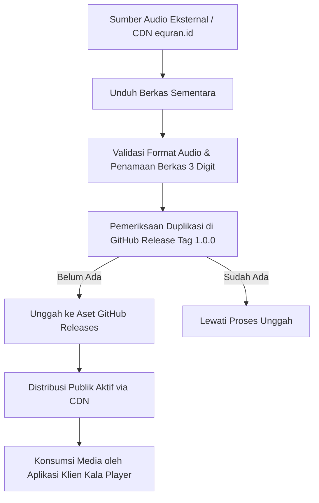

# Dokumentasi Sistem Quran Audio Dataset (CDN Media)

Dokumen ini menjelaskan logika bisnis, aturan domain, dan siklus hidup entitas distribusi audio murottal Al-Qur'an 30 Juz (114 Surah).

## Siklus Hidup Entitas (Entity Lifecycle)

## Aturan Entitas Berkas Audio (Entity Rules)

| Entitas / Bidang | Aturan Validasi | Catatan Bisnis |
|---|---|---|
| Nomor Surah (`nomor`) | Integer, rentang 1 sampai 114 | Standar urutan mushaf Al-Qur'an internasional. |
| Format Penamaan Berkas (`fileName`) | String 3 digit ditambah ekstensi `.mp3` (`{001..114}.mp3`) | Konsistensi URL akses klien tanpa variasi nama khusus. |
| Tag Rilis (`tag_name`) | Format string semver (`1.0.0`) | Menjadi penentu path rute unduhan publik CDN. |
| Format Audio | MP3 Stereo, 128 kbps, 44.1 kHz | Kompromi optimal antara efisiensi kuota data dan kualitas suara. |
| Tipe Penyimpanan | GitHub Releases Binary Asset | Menghindari bloat pada pohon komit git repositori. |

## Tabel Transisi Status Aset

| Status Awal | Pemicu (Trigger) | Status Akhir | Deskripsi |
|---|---|---|---|
| `Tersedia di Sumber` | Eksekusi sinkronisasi | `Sedang Diunduh` | Berkas diambil ke folder sementara lokal. |
| `Sedang Diunduh` | Unduhan tuntas | `Tervalidasi` | Berkas berukuran wajar dan memiliki penamaan valid. |
| `Tervalidasi` | Panggilan API unggah aset | `Sedang Diunggah` | Pengiriman stream binary ke server rilis GitHub. |
| `Sedang Diunggah` | Unggah selesai 100% | `Terpublikasi (CDN)` | Berkas aktif dan dapat di-stream publik tanpa token autentikasi. |
| `Terpublikasi (CDN)` | Pengecekan aset berikutnya | `Dilewati (Skip)` | Berkas yang telah ada tidak diunggah ulang guna menghemat bandwidth. |

## Batasan Bisnis & Pemicu (Constraints & Triggers)

- **Immutability Cabang Git:** Berkas audio biner tidak boleh di-commit langsung ke riwayat Git (`git commit`) guna menjaga repositori tetap berukuran kecil (< 5 MB).
- **Idempotensi Sinkronisasi:** Proses sinkronisasi otomatis selalu memeriksa daftar aset yang telah ada sebelum mengunggah, sehingga aman dijalankan berulang kali tanpa risiko duplikasi atau kegagalan unggah.
- **Ketersediaan Publik Bebas Biaya:** Seluruh aset wajib dapat diakses melalui metode HTTP GET tanpa memerlukan token otorisasi pengguna akhir.
- **Dukungan Streaming Lanjutan:** Aset CDN wajib mendukung pemutaran bertahap (*HTTP Range Request 206 Partial Content*) agar pengguna dapat melakukan pencarian durasi (*scrubbing*) audio secara mulus.
